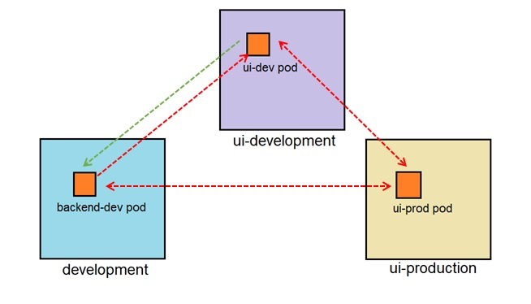

# Security (12%)

## Curriculum
* Know how to configure [authentication](https://kubernetes.io/docs/reference/access-authn-authz/authentication/) and [authorization](https://kubernetes.io/docs/reference/access-authn-authz/authorization/).  
    * [Using RBAC Authorization.](https://kubernetes.io/docs/reference/access-authn-authz/rbac/)
    * [Using ABAC Authorization.](https://kubernetes.io/docs/reference/access-authn-authz/abac/)
    * [Using Node Authorization.](https://kubernetes.io/docs/reference/access-authn-authz/node/)
* [Understand Kubernetes security primitives.](https://kubernetes.io/docs/concepts/policy/pod-security-policy/)
* [Know to configure network policies.](https://kubernetes.io/docs/concepts/services-networking/network-policies/)
* [Create and manage TLS certificates for cluster components.](https://kubernetes.io/docs/reference/command-line-tools-reference/kubelet-tls-bootstrapping/)
* [Work with images securely.](https://kubernetes.io/docs/tasks/configure-pod-container/pull-image-private-registry/)
* [Define security contexts.](https://kubernetes.io/docs/tasks/configure-pod-container/security-context/) 
* [Secure persistent key value store.](https://kubernetes.io/docs/tasks/administer-cluster/configure-upgrade-etcd/)

## Extra Links
* [Kubernetes Network Policy Recipes](https://github.com/ahmetb/kubernetes-network-policy-recipes)
* [Setting Up Pod Security Policies](https://octetz.com/posts/setting-up-psps)


## Exercices

1. Create a service account called sa-security-example.
    <details><summary>show</summary>
    <p>

    ```bash
    kubectl create sa sa-security-example
    ```

    </p>
    </details>

1. Curl the API server using the sa-security-example service account.
    <details><summary>show</summary>
    <p>

    ```bash
    SERVICE_ACCOUNT=sa-security-example
    
    SECRET=$(kubectl get serviceaccount ${SERVICE_ACCOUNT} -o json | jq -Mr '.secrets[].name | select(contains("token"))')
    
    TOKEN=$(kubectl get secret ${SECRET} -o json | jq -Mr '.data.token' | base64 -d)
    
    kubectl get secret ${SECRET} -o json | jq -Mr '.data["ca.crt"]' | base64 -d > ~/ca.crt
    
    APISERVER=`grep server  ~/.kube/config | awk {'print $2'}`

    curl -s $APISERVER  --header "Authorization: Bearer $TOKEN" --cacert ~/ca.crt
    ```

    </p>
    </details>   

1. Use a [x509 client certificate](https://kubernetes.io/docs/reference/access-authn-authz/authentication/#x509-client-certs) to authenticate API requests.
    <details><summary>show</summary>
    <p>

    ```bash
    mkdir $HOME/x509-exercice

    # Copy the ca k8s certifate in x509-exercice
    cp /etc/kubernetes/pki/ca.* $HOME/x509-exercice

    # Create the crt certficate for a user (e.g john)
    openssl genrsa -out $HOME/x509-exercice/john.key 2048
    openssl req -new -key $HOME/x509-exercice/john.key -out $HOME/x509-exercice/john-csr.pem -subj "/CN=john/O=developer"
    openssl x509 -req -in $HOME/x509-exercice/john-csr.pem -CA $HOME/x509-exercice/ca.crt -CAkey $HOME/x509-exercice/ca.key -CAcreateserial -out $HOME/x509-exercice/john.crt -days 365

    # Get the API Server URL
    APISERVER=`grep server  $HOME/.kube/config | awk {'print $2'}`

    # Create the john-config kubernetes file
    # Set up the cluster in the john-config file
    kubectl config set-cluster k8s-exercice --certificate-authority=$HOME/x509-exercice/ca.crt --embed-certs=true --server=$APISERVER --kubeconfig=$HOME/x509-exercice/john-config
    # Set up the user in the john-config file
    kubectl config set-credentials john --client-certificate=$HOME/x509-exercice/john.crt --client-key=$HOME/x509-exercice/john.key --embed-certs=true --kubeconfig=$HOME/x509-exercice/john-config
    # Set up the context in the john-config file
    kubectl config set-context default --cluster=k8s-exercice --user=john --kubeconfig=$HOME/x509-exercice/john-config
    # Set up default as current context in the john-config file
    kubectl config use-context default --kubeconfig=$HOME/x509-exercice/john-config

    # Test the john-config file
    kubectl get ns --kubeconfig=$HOME/x509-exercice/john-config
    
    # Another way to test the user
    curl $APISERVER/api/v1/namespaces --cacert $HOME/x509-exercice/ca.crt --cert $HOME/x509-exercice/john.crt --key $HOME/x509-exercice/john.key
    or 
    kubectl get ns --as john

    Error from server (Forbidden): namespaces is forbidden: User "john" cannot list resource "namespaces" in API group "" at the cluster scope
    ```
    > The output from the last command is correct since john was **authenticate** for accessing the API Server but the user is not **authorize** for listing the k8s namespaces.

    </p>
    </details>   

1. Use a [Static Password File](https://kubernetes.io/docs/reference/access-authn-authz/authentication/#static-password-file) to authenticate API requests.
    <details><summary>show</summary>
    <p>

    ```bash
    mkdir -p /etc/kubernetes/static-users
    mkdir -p $HOME/static-exercice

    # Copy the ca k8s certifate in static-exercice folder
    cp /etc/kubernetes/pki/ca.* $HOME/static-exercice

    # Create a csv file in the static-exercice folder with the user details [password,user,uid,"group1,group2,group3"]
    vim /etc/kubernetes/static-users/users.csv
    test,eve,eve123,qa
    ```
    ```bash
    # Modify the API Server passing the --basic-auth-file=SOMEFILE option
    apiVersion: v1
    kind: Pod
    metadata:
    creationTimestamp: null
    labels:
    component: kube-apiserver
    tier: control-plane
    name: kube-apiserver
    namespace: kube-system
    spec:
    containers:
    - command:
        - kube-apiserver
        - --advertise-address=xxxx
        - --allow-privileged=true
        - --authorization-mode=Node,RBAC
        # Add The following line
        - --basic-auth-file=/etc/kubernetes/static-users/users.csv       
        ...
        - --tls-private-key-file=/etc/kubernetes/pki/apiserver.key
        image: k8s.gcr.io/kube-apiserver:v1.15.1
        imagePullPolicy: IfNotPresent
        livenessProbe:
        failureThreshold: 8
        httpGet:
            host: xxxx
            path: /healthz
            port: 6443
            scheme: HTTPS
        initialDelaySeconds: 15
        timeoutSeconds: 15
        name: kube-apiserver
        resources:
        requests:
            cpu: 250m
        volumeMounts:
        ...
        ...
        - mountPath: /usr/share/ca-certificates
        name: usr-share-ca-certificates
        readOnly: true
        # Mount the static-users directory
        - mountPath: /etc/kubernetes/static-users
        name: user-credentials
        readOnly: true
    hostNetwork: true
    priorityClassName: system-cluster-critical
    volumes:
    ...
    # Add the static-users volumen
    - hostPath:
        path: /etc/kubernetes/static-users
        type: DirectoryOrCreate
        name: user-credentials
    status: {}
    ```
    ```bash
    # Get the API Server URL
    APISERVER=`grep server  $HOME/.kube/config | awk {'print $2'}`

    # Create the eve-config kubernetes file
    # Set up the cluster in the eve-config file
    kubectl config set-cluster k8s-exercice --certificate-authority=$HOME/static-exercice/ca.crt --embed-certs=true --server=$APISERVER --kubeconfig=$HOME/static-exercice/eve-config
    # Set up the user in the eve-config file
    kubectl config set-credentials eve --username=eve --password=test --kubeconfig=$HOME/static-exercice/eve-config
    # Set up the context in the eve-config file
    kubectl config set-context default --cluster=k8s-exercice --user=eve --kubeconfig=$HOME/static-exercice/eve-config
    # Set up default as current context in the eve-config file
    kubectl config use-context default --kubeconfig=$HOME/static-exercice/eve-config

    # Test the eve-config file
    kubectl get ns --kubeconfig=$HOME/static-exercice/eve-config
    
    # Another way to test the eve user
    curl $APISERVER/api/v1/namespaces --cacert $HOME/static-exercice/ca.crt --user eve:test
    or
    kubectl get ns --as eve
    
    Error from server (Forbidden): namespaces is forbidden: User "eve" cannot list resource "namespaces" in API group "" at the cluster scope
    ```
    > The output from the last command is correct since eve was **authenticate** for accessing the API Server but the user is not **authorize** for listing the k8s namespaces.
    </p>
    </details> 

1. Grant only read access to pods within the john-ns to user john.
    <details><summary>show</summary>
    <p>

    ```bash
    kubectl create ns john-ns
    
    # Create a Role named john-pod-reader that allows a user to “get”, “watch” and “list” on pods in john-ns namespace
    kubectl create role john-pod-reader --verb=get,list,watch --resource=pods --namespace=john-ns
    
    # Within the namespace “john-ns”, grant the permissions in the john-pod-reader Role to a user named “john”:
    kubectl create rolebinding john-pod-reader-binding --role=john-pod-reader --user=john --namespace=john-ns
   
    # Test the john permission to get pods 
    kubectl get pods -n john-ns --kubeconfig=$HOME/x509-exercice/john-config
    ```
    </p>
    </details> 

1. Grant only read access to secrets within the eve-ns to user eve.
    <details><summary>show</summary>
    <p>

    ```bash
    kubectl create ns eve-ns
    
    # Create a Role named eve-secrets-reader that allows a user to “get”, “watch” and “list” on secrets in eve-ns namespace
    kubectl create role eve-secrets-reader --verb=get,list,watch --resource=secrets --namespace=eve-ns
    
    # Within the namespace “eve-ns”, grant the permissions in the eve-secrets-reader Role to a user named “eve”:
    kubectl create rolebinding eve-secrets-reader-binding --role=eve-secrets-reader --user=eve --namespace=eve-ns
   
    # Test the eve permission to get secrets 
    kubectl get secrets -n eve-ns --kubeconfig=$HOME/static-exercice/eve-config
    ```

    </p>
    </details>   

           
1. Get secrets in the eve-ns using the john user acting as eve and admin.
    > _Tipp:_ A user can act as another user through impersonation headers.

    <details><summary>show</summary>
    <p>

    ```bash
    kubectl get secrets -n eve-ns --kubeconfig=$HOME/x509-exercice/john-config --as eve
    Error from server (Forbidden): users "eve" is forbidden: User "john" cannot impersonate resource "users" in API group "" at the cluster scope

    kubectl get secrets -n eve-ns --kubeconfig=$HOME/x509-exercice/john-config --as admin
    Error from server (Forbidden): users "admin" is forbidden: User "john" cannot impersonate resource "users" in API group "" at the cluster scope

    # Create the ClusterRole and the ClusterRoleBinding configuration files
    vim impersonate-files.yaml

        apiVersion: rbac.authorization.k8s.io/v1
        kind: ClusterRole
        metadata:
        name: impersonator
        rules:
        - apiGroups: [""]
        resources: ["users"]
        verbs: ["impersonate"]
        ---
        apiVersion: rbac.authorization.k8s.io/v1
        kind: ClusterRoleBinding
        metadata:
        name: impersonate
        roleRef:
        apiGroup: rbac.authorization.k8s.io
        kind: ClusterRole
        name: cluster-admin-impersonator
        subjects:
        - apiGroup: rbac.authorization.k8s.io
        kind: User
        name: john

    kubectl create -f impersonate-files.yaml

    # Test the configuration
    kubectl get secrets -n eve-ns --kubeconfig=$HOME/x509-exercice/john-config --as eve
    NAME                  TYPE                                  DATA   AGE
    default-token-z6kh7   kubernetes.io/service-account-token   3      13m

    kubectl get secrets -n eve-ns --kubeconfig=$HOME/x509-exercice/john-config --as admin
    NAME                  TYPE                                  DATA   AGE
    default-token-z6kh7   kubernetes.io/service-account-token   3      13m
    ```

    </p>
    </details>

1. Change the previous configuration to get secrets in the eve-ns using the john user acting **only** as eve. John is not allow to use user admin as impersonalitation. 
    <details><summary>show</summary>
    <p>

    ```bash
    # Change the ClusterRole and the ClusterRoleBinding configuration files
    vim impersonate-files.yaml

        apiVersion: rbac.authorization.k8s.io/v1
        kind: ClusterRole
        metadata:
        name: impersonator
        rules:
        - apiGroups: [""]
        resources: ["users"]
        verbs: ["impersonate"]
        # Add the following line
        resourceNames: ["eve"]
        ---
        apiVersion: rbac.authorization.k8s.io/v1
        kind: ClusterRoleBinding
        metadata:
        name: impersonate
        roleRef:
        apiGroup: rbac.authorization.k8s.io
        kind: ClusterRole
        name: cluster-admin-impersonator
        subjects:
        - apiGroup: rbac.authorization.k8s.io
        kind: User
        name: john

    kubectl apply -f impersonate-files.yaml

    # Test the configuration
    kubectl get secrets -n eve-ns --kubeconfig=$HOME/x509-exercice/john-config --as eve
    NAME                  TYPE                                  DATA   AGE
    default-token-z6kh7   kubernetes.io/service-account-token   3      13m

    kubectl get secrets -n eve-ns --kubeconfig=$HOME/x509-exercice/john-config --as admin
    Error from server (Forbidden): users "admin" is forbidden: User "john" cannot impersonate resource "users" in API group "" at the cluster scope
    ```

    </p>
    </details>

1. Use the following environment: `curl -s "https://raw.githubusercontent.com/roxcarpio/cka-exercises/master/exercices/e.security/networkPolicy1.sh" | bash`. Test that the traffic between the nginx-a pod and the nginx-b pod is blocked [from nginx-a to nginx-b and from nginx-b to nginx-a]. Create a network policy that allows the nginx-b pod talk with nginx-a. 

    <details><summary>show</summary>
    <p>

    ```bash
    # Test the connection from A to B and from B to A
    kubectl exec nginx-a -n network-policy-test-1 -- sh -c 'wget -qO- --timeout=2 http://nginx-b:80'
    command terminated with exit code 4

    kubectl exec nginx-b -n network-policy-test-1 -- bash -c 'wget -qO- --timeout=2 http://nginx-a:80'
    command terminated with exit code 4

    # Crete the network policy
    vim api-allow.yaml
    
    kind: NetworkPolicy
    apiVersion: networking.k8s.io/v1
    metadata:
      name: api-allow
    spec:
      podSelector:
        matchLabels:
          run: nginx-a
      ingress:
      - from:
        - podSelector:
            matchLabels:
              run: nginx-b

    kubectl create -f api-allow.yaml -n network-policy-test-1

    # Test the network policy
    kubectl exec nginx-a -n network-policy-test-1 -- sh -c 'wget -qO- --timeout=2 http://nginx-b:80'
    command terminated with exit code 4

    kubectl exec nginx-b -n network-policy-test-1 -- bash -c 'wget -qO- --timeout=2 http://nginx-a:80' # Works
    ```

    </p>
    </details>

1. Use the following environment: `curl -s "https://raw.githubusercontent.com/roxcarpio/cka-exercises/master/exercices/e.security/networkPolicy2.sh" | bash`. Test the traffic between all the pods. Create a network policy that allows pods from the **ui-development** namespace talk with pods in the **development** namespace.


    <details><summary>show</summary>
    <p>

    ```bash
    # Test
    # From backend-dev pod
    kubectl exec backend-dev -n development -- sh -c 'wget -qO- --timeout=2 http://ui-dev.ui-development:80' # Traffic is blocked
    kubectl exec backend-dev -n development -- sh -c 'wget -qO- --timeout=2 http://ui-prod.ui-production:80' # Traffic is blocked

    # From ui-dev pod
    kubectl exec ui-dev -n ui-development -- sh -c 'wget -qO- --timeout=2 http://backend-dev.development:80' # Traffic is blocked
    kubectl exec ui-dev -n ui-development -- sh -c 'wget -qO- --timeout=2 http://ui-prod.ui-production:80' # Traffic is blocked

    # From ui-prod pod
    kubectl exec ui-prod -n ui-production -- sh -c 'wget -qO- --timeout=2 http://ui-dev.ui-development:80' # Traffic is blocked
    kubectl exec ui-prod -n ui-production -- sh -c 'wget -qO- --timeout=2 http://backend-dev.development:80' # Traffic is blocked

    # Crete the network policy
    vim nampespace-allow.yaml
    
    kind: NetworkPolicy
    apiVersion: networking.k8s.io/v1
    metadata:
      name: nampespace-allow
    spec:
      podSelector: {}
      ingress:
      - from:
        - namespaceSelector:
            matchLabels:
              purpose: dev

    kubectl create -f api-allow.yaml -n development

    # Test the network policy
    # From backend-dev pod
    kubectl exec backend-dev -n development -- sh -c 'wget -qO- --timeout=2 http://ui-dev.ui-development:80' # Traffic is blocked
    kubectl exec backend-dev -n development -- sh -c 'wget -qO- --timeout=2 http://ui-prod.ui-production:80' # Traffic is blocked

    # From ui-dev pod
    kubectl exec ui-dev -n ui-development -- sh -c 'wget -qO- --timeout=2 http://backend-dev.development:80' # Traffic is allowed
    kubectl exec ui-dev -n ui-development -- sh -c 'wget -qO- --timeout=2 http://ui-prod.ui-production:80' # Traffic is blocked

    # From ui-prod pod
    kubectl exec ui-prod -n ui-production -- sh -c 'wget -qO- --timeout=2 http://ui-dev.ui-development:80' # Traffic is blocked
    kubectl exec ui-prod -n ui-production -- sh -c 'wget -qO- --timeout=2 http://backend-dev.development:80' # Traffic is blocked
    ```

    </p>
    </details>

1. Create and manage TLS certificates for all the cluster components [Ref. Kubernetes the hard Way](https://github.com/kelseyhightower/kubernetes-the-hard-way/blob/master/docs/04-certificate-authority.md):    
    
    <details><summary>show</summary>
    <p>
    
    ```bash
    ## Prerequisites
    
    # Install cfssl & cfssljson
    wget -q --show-progress --https-only --timestamping https://pkg.cfssl.org/R1.2/cfssl_linux-amd64 https://pkg.cfssl.org/R1.2/cfssljson_linux-amd64

    chmod +x cfssl_linux-amd64 cfssljson_linux-amd64

    mv cfssl_linux-amd64 /usr/local/bin/cfssl

    mv cfssljson_linux-amd64 /usr/local/bin/cfssljson

    # Test the installation
    cfssl version

    # Download and extract the k8s json files
    wget -c https://github.com/roxcarpio/cka-exercises/raw/master/exercices/e.security/k8s-configuration-files.tar.gz -O - | tar -xz

    cd k8s-configuration-files/

    # Certificate Authority
    cfssl gencert -initca ca-csr.json | cfssljson -bare ca

    # Admin Certificate
    cfssl gencert -ca=ca.pem -ca-key=ca-key.pem -config=ca-config.json -profile=kubernetes admin-csr.json | cfssljson -bare admin

    # Worker Certificate
    WORKER_HOST_NAME=worker-0
    WORKER_IP=10.0.3.6
    LOAD_BALANCER_HOST_NAME=k8s_cluster
    LOAD_BALANCER_IP=10.0.3.212   

    cfssl gencert -ca=ca.pem -ca-key=ca-key.pem -config=ca-config.json -hostname=${WORKER_HOST_NAME},${WORKER_IP},${LOAD_BALANCER_HOST_NAME},${LOAD_BALANCER_IP} -profile=kubernetes worker-0-csr.json | cfssljson -bare worker-0

    # Controller Manager Client Certificate
    cfssl gencert -ca=ca.pem -ca-key=ca-key.pem -config=ca-config.json -profile=kubernetes kube-controller-manager-csr.json | cfssljson -bare kube-controller-manager

    # Kube Proxy Client Certificate
    cfssl gencert -ca=ca.pem -ca-key=ca-key.pem -config=ca-config.json -profile=kubernetes kube-proxy-csr.json | cfssljson -bare kube-proxy

    # Scheduler Client Certificate
    cfssl gencert -ca=ca.pem -ca-key=ca-key.pem -config=ca-config.json -profile=kubernetes kube-scheduler-csr.json | cfssljson -bare kube-scheduler

    # API Server Certificate
    MASTER_IP=10.0.3.49
    LOAD_BALANCER_HOST_NAME=k8s_cluster
    LOAD_BALANCER_IP=10.0.3.212 
    CLUSTER_NETWORK_IP=10.32.0.1
    
    cfssl gencert -ca=ca.pem -ca-key=ca-key.pem -config=ca-config.json -hostname={CLUSTER_NETWORK_IP},{MASTER_IP},{LOAD_BALANCER_IP},${LOAD_BALANCER_HOST_NAME},127.0.0.1,kubernetes.default -profile=kubernetes kubernetes-csr.json | cfssljson -bare kubernetes

    # Service Account Key Pair
    cfssl gencert -ca=ca.pem -ca-key=ca-key.pem -config=ca-config.json -profile=kubernetes service-account-csr.json | cfssljson -bare service-account
    ```
    </p>
    </details>

1. Create a PodSecurityPolicy in the psp namespace that restricts the use of `hostPath` volumes and allows confimaps as volumes.
    > _Tipp:_ Enable the **PodSecurityPolicy** admission controller for this exercice

    <details><summary>show</summary>
    <p>

    ```bash
    kubectl create ns psp

    vim psp-restrict-volumen.yaml
    apiVersion: policy/v1beta1
    kind: PodSecurityPolicy
    metadata:
      name: psp-restrict-volumen
      namespace: psp
    spec:
      privileged: false  
      seLinux:
        rule: RunAsAny
      supplementalGroups:
        rule: RunAsAny
      runAsUser:
        rule: RunAsAny
      fsGroup:
        rule: RunAsAny
      volumes:
      - 'configMap'

    kubectl create -f psp-restrict-volumen.yaml

    kubectl get psp

    vim psp-restrict-volumen-role.yaml
    kind: Role
    apiVersion: rbac.authorization.k8s.io/v1
    metadata:
      name: psp-restrict-volumen-role
      namespace: psp
    rules:
    - apiGroups:
      - extensions
      resources:
      - podsecuritypolicies
      resourceNames:
      - psp-restrict-volumen
      verbs:
      - use

    vim psp-restrict-volumen-binding.yaml
    kind: RoleBinding
    apiVersion: rbac.authorization.k8s.io/v1
    metadata:
      name: psp-restrict-volumen-binding
      namespace: psp      
    subjects:
    - kind: Group
      name: system:serviceaccounts:psp
      apiGroup: rbac.authorization.k8s.io
    roleRef:
      kind: Role
      name: psp-restrict-volumen-role
      apiGroup: rbac.authorization.k8s.io      
    
    vim pod.yaml
    
    apiVersion: apps/v1
    kind: Deployment
    metadata:
      name: test-psp
      namespace: psp
    spec:
      replicas: 1
      selector:
        matchLabels:
          app: test
      template:
        metadata:
          labels:
            app: test      
        spec:
          containers:
          - image: k8s.gcr.io/test-webserver
            name: test-container
            volumeMounts:
            - mountPath: /cache
              name: cache-volume
          volumes:
          - name: cache-volume
            emptyDir: {}    
    ```

    </p>
    </details>